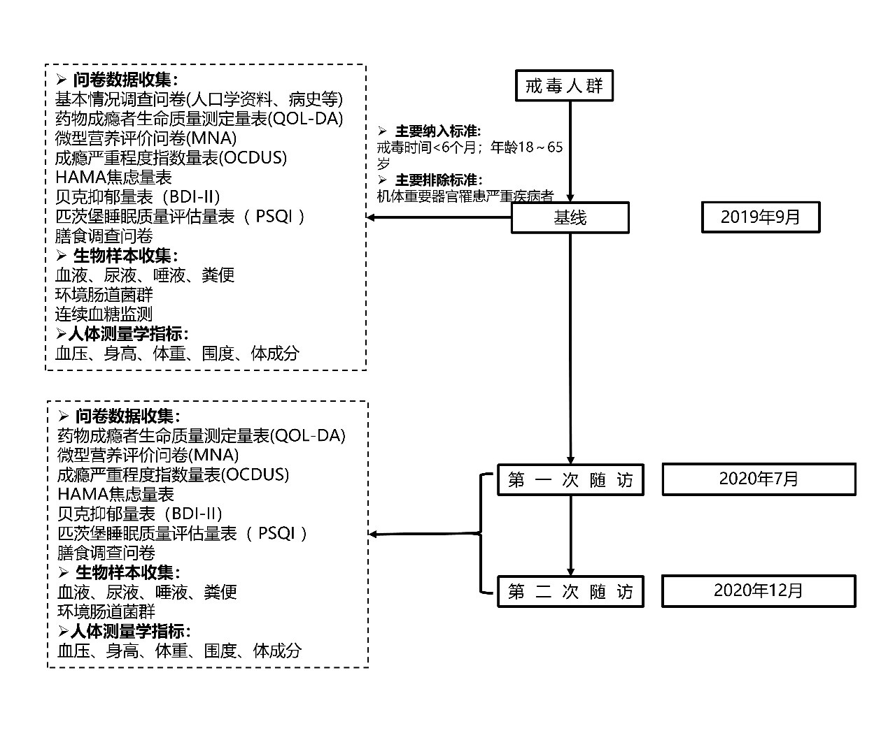

# 戒毒人群个性化营养与健康项目

## 数据基础信息

**数据来源**：浙江省戒毒管理局

**时间**：2019年9月、2020年7月、2020年12月

**采集流程**：

**基线的现场调查流程**（每个戒毒所正式现场工作均为两天）：

*第一天*：

1.1 入组招募

纳入标准：1.无严重身体器官衰竭；2.年龄在18-65岁；3.入所时间不超过3个月；4.无严重传染病（甲肝，乙肝，艾滋病等）；5.无严重精神病；6.无癌症。

1.2 招募登记

参与者依次排队填写登记表（包括姓名，ID，身份证号，性别等），领取号码牌及带有标签的唾液收集器后，统一去机房填写问卷。

1.3 体质检测

调查员对参与者测量并记录：身高，体重，腰围，臀围，颈围，上臂围，小腿围，体成分，血压（收缩压和舒张压）。

1.4 佩戴瞬感

调查员依次给参与者佩戴瞬感并激活，激活时间两分钟。同时发放包装袋（装有粪便杯（另加一个5mlEP管）及尿液采集器）和饮食日记表。
事先根据戒毒所预定好的的食堂菜单打印好饮食日记以及食堂标准记录表。
最后通知参与者第二天空腹收集尿液及粪便。

*第二天*：

2.1 样本收集

2.2 血液采集

*14天后*：

调查员协助参与者摘除瞬感并放置相应包装袋，收取饮食日记及食堂膳食标准称重记录。

## 拟定完成任务

- [x] 数据提取与整理
- [x] 数据清洗
- [x] 数据可视化
- [x] 确认数据关联性
- [ ] 确定项目主题

